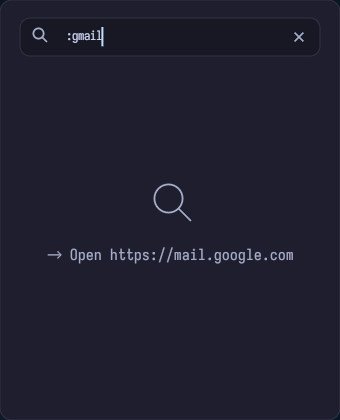

# easycopy

Linux clipboard history manager. Daemon monitors the clipboard, popup lets you browse, search, and paste.

> **Warning**
> easycopy has only been tested on X11 with i3. Wayland and other desktop environments may have bugs, especially around global hotkeys, focus handling, and auto-paste.

## Features

- Text and image clipboard history
- Keyboard-first popup with fast search
- `/` prefix for app-only search
- `:` prefix for browser actions (open URLs and web searches)
- Frequent items are prioritized in search results
- Themes, font presets, and compact layout options
- X11 auto-paste support through `xdotool`
- AI chat: type `/` with no app matches to ask an AI (optional, configurable provider)

<p align="center">
  
</p>

## Screenshots

| App search | Image preview |
| --- | --- |
|  |  |

| Theme picker | Footer controls |
| --- | --- |
|  |  |

| Browser action: preset Gmail | Browser action: search if no match | Browser action: show previous |
| --- | --- | --- |
|  |  |  |

## Usage

```bash
easycopy          # start daemon
easycopy --popup  # open popup
easycopy --clear  # delete history and saved images
easycopy -V       # version
easycopy -h       # help
```

Default hotkey: **Ctrl+Alt+V**.

## Configuration

First run creates `~/.config/easycopy/config.toml`.

<details>
<summary>Default config</summary>

```toml
[general]
max_text_items = 200
max_image_items = 50
hotkey = "Ctrl+Alt+V"
auto_paste = true
poll_interval_ms = 500
popup_width = 640.0
popup_height = 720.0
preview_chars = 220
paste_delay_ms = 120
theme = "dark"
hide_main_header = false
hide_secondary_header = false
hide_counts = false
enable_theming = true
enable_clipping = true
close_on_focus_out = true
keep_search_on_reopen = true
debug_logging = false
font_preset = "default"
font_size = "medium"
font_proportional_path = ""
font_monospace_path = ""
font_weight = "normal"

[footer]
enable = true
show_help = true
show_clear = true
show_settings = true
show_theme = true

[ai]
enable = false
provider = "gemini"
model = ""
system_prompt = "You are a concise assistant inside a clipboard manager."
stream = true
ollama_url = "http://localhost:11434"
```
</details>

Supported values:

- `theme`: `dark`, `light`, `nord`, `catppuccin`, `dracula`, `system`
- `font_preset`: `default`, `dejavu`, `liberation`, `fira`, `jetbrains`, `iosevka`
- `font_size`: `small`, `medium`, `large`
- `font_weight`: `normal`, `bold`

The popup also has an in-app settings dropdown where themes, fonts, and font size can be changed and saved instantly.

## AI chat

The popup has an optional AI chat mode. Type `/` followed by a query that matches no apps (e.g. `/what is 2+2`) and the popup switches to a chat panel where you can converse with an AI. Replies stream in live; press **Esc** to leave chat mode. Conversation history is persisted across popup opens in `~/.local/share/easycopy/chat.db`.

Enable it in `~/.config/easycopy/config.toml`:

```toml
[ai]
enable = true
provider = "ollama"              # gemini | openai | anthropic | ollama
model = "llama3.2"               # auto-filled per provider if empty
system_prompt = "You are a concise assistant inside a clipboard manager."
stream = true
max_tokens = 512
temperature = 0.3
ollama_url = "http://localhost:11434"   # ollama only
```

Cloud providers read their API key from the environment — never store keys in the config file:

| Provider | Env var | Example model |
| --- | --- | --- |
| `ollama` | _(none — run `ollama serve`)_ | `llama3.2` |
| `gemini` | `GOOGLE_API_KEY` | `gemini-2.5-flash` |
| `openai` | `OPENAI_API_KEY` | `gpt-4o-mini` |
| `anthropic` | `ANTHROPIC_API_KEY` | `claude-sonnet-4-6` |

Controls in the chat panel: **New chat** starts a fresh conversation, **Continue** resumes the last, and **Copy last answer** copies the latest reply to the clipboard.

> **Note:** AI support requires Rust **1.94+** and increases the release binary to ~22 MB (tokio + reqwest + sqlx + the provider clients). It is compiled in regardless of `enable`; set `enable = false` to keep the feature dormant.

## i3 integration

<details>
<summary>Auto-start and borderless popup</summary>

Add to your i3 config:

```
exec_always --no-startup-id easycopy
for_window [class="easycopy"] \
    floating enable, \
    border none, \
    move position center
```

The popup already sets `decorations(false)` and `always_on_top`, so with the `border none` rule it appears as a clean floating window.
</details>

<details>
<summary>systemd user service</summary>

```ini
[Unit]
Description=easycopy clipboard history daemon
After=graphical-session.target

[Service]
Type=simple
ExecStart=%h/.local/bin/easycopy
Restart=on-failure
RestartSec=2

[Install]
WantedBy=default.target
```

Save as `~/.config/systemd/user/easycopy.service`, then:

```bash
systemctl --user enable --now easycopy
```
</details>

## Notes

- **Auto-paste** uses `xdotool` (X11 only). On strict Wayland, set `auto_paste = false`.
- **X11 event source** — when running on X11, clipboard changes are detected via the XFixes extension (event-driven, no CPU polling). Falls back to timer polling on Wayland.
- **Global hotkeys** depend on desktop environment permissions.

## Build

See [BUILD.md](BUILD.md) for source build instructions and distro dependencies.
